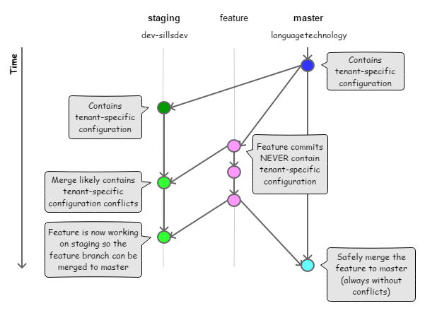

# Auth0 Tenant Configuration

This repository contains the authoritative configuration for SIL Auth0 tenants. The configuration will automatically deploy to Auth0 whenever commits are pushed to this repository.

## Tenants

| Tenant             | Branch  |
| :----------------- | :------ |
| languagetechnology | master  |
| dev-sillsdev       | staging |

## Gitflow

We use [Gitflow](http://nvie.com/posts/a-successful-git-branching-model/) with some modifications.

<p align="center">
    
</p>

The master branch contains configuration for the **languagetechnology** tenant. A `staging` branch could branch off of `master` and contain configuration for the **dev-sillsdev** tenant.

To add a new feature, create a new branch from `master` (`feature` branch in the diagram). It's important that the `feature` branch never contain tenant-specific configuration.

To test it, merge it into the `staging` branch. This merge will likely have conflicts specific to the staging tenant. It may be necessary to add a commit to the `staging` branch if there is configuration added or deleted on `master` that doesn't exist on `staging`.

Continue developing the `feature` and merging to `staging` until testing confirms the `feature` is ready. Then merge `feature` into `master` to release to production. This merge will never have conflicts because the `feature` branch never contains tenant-specific configuration and it originated from `master`.

## Internationalization and Localization

See [documentation](i18n.md).

## How to update settings

There are two workflows for updating the settings for an Auth0 tenant.

### Update files directly

The settings files can be updated directly. For more information on the format of the settings files, see the Auth0 documentation on [GitHub Deployments](https://auth0.com/docs/extensions/github-deploy#deployment).

### Use Auth0 Deploy CLI Tool

The Auth0 management UI can often be more straightforward to update than opaque settings files. It is possible to make changes in the Auth0 UI and then export the settings to a directory using the [Auth0 Deploy CLI Tool](https://auth0.com/docs/extensions/deploy-cli). These settings can be copied over to the repo. To export settings from a tenant, follow these steps:

1. Install the Deploy CLI tool using `npm`:

```
npm i -g auth0-deploy-cli
```

2. Setup the Deploy tool configuration for the tenant by creating the following JSON file:

```json
{
  "AUTH0_DOMAIN": "languagetechnology.auth0.com",
  "AUTH0_CLIENT_ID": "<client_id>",
  "AUTH0_CLIENT_SECRET": "<client_secret>",
  "AUTH0_KEYWORD_REPLACE_MAPPINGS": {
    "AUTH0_TENANT_NAME": "languagetechnology.auth0.com"
  },
  "AUTH0_ALLOW_DELETE": false,
  "AUTH0_EXCLUDED_RULES": []
}
```

Replace `client_id` and `client_secret` with the values from the `auth0-deploy-cli-extension` application in the Auth0 management UI. If you want to export changes from the `dev-sillsdev` tenant, replace `languagetechnology.auth0.com` with `dev-sillsdev.auth0.com`.

3. Export the settings from the tenant using the following command:

```
a0deploy export -c <config_file> --strip -f directory -o <export_directory>
```

Replace `config_file` with the path to the file created in step 2 and replace `export_directory` with the path to the directoy where you want to export the tenant settings.

4. Copy the desired settings files from the exported directory to the repo and push the changes.
